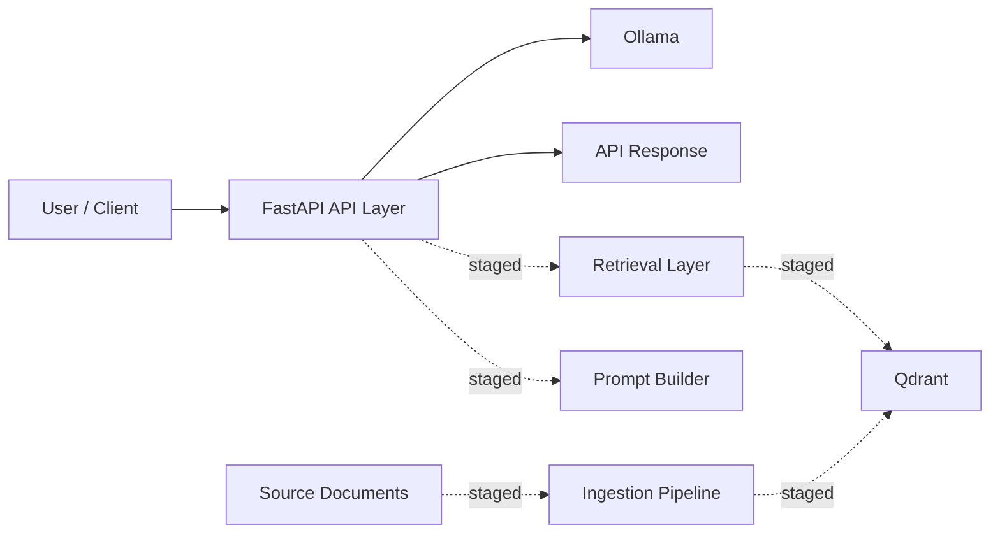
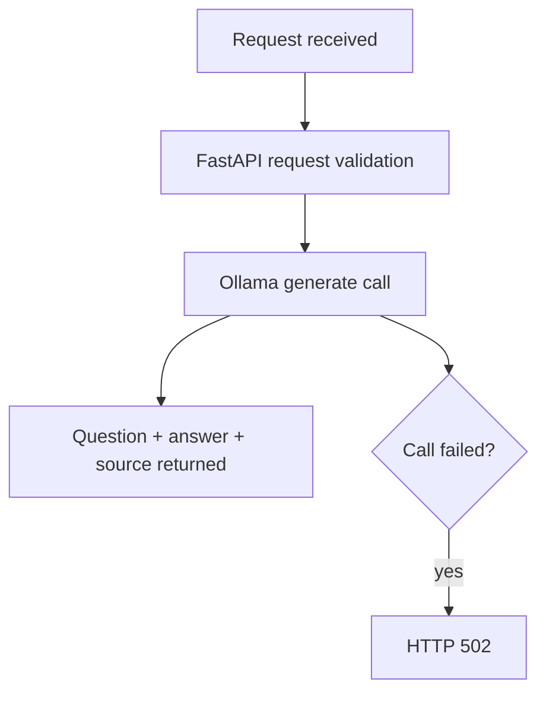

# Architecture Packaging Baseline

## Project Summary

Enterprise GenAI Platform is a local, enterprise-style GenAI reference system. The current verified baseline is a FastAPI API with a health route and an Ollama-backed `/ask` route, alongside staged repository modules for ingestion, retrieval, prompting, and vector storage.

## Current Verified Local Stack

- Ollama for the live `/ask` model call
- FastAPI for the active API layer
- Python application modules for configuration, schemas, and routing
- Tests covering the current health and Ollama-backed `/ask` behavior

## Staged Repository Components

The repository also includes staged modules for:

- ingestion and chunking
- embeddings generation
- vector storage with Qdrant
- retrieval orchestration
- grounded prompt construction

These components are part of the repository architecture, but they are not yet treated as integrated live baseline unless they are connected to the active route and verified.

## Main Components

- Live API layer: FastAPI routes, request/response schemas, and Ollama-backed answering
- Staged retrieval layer: query embedding, Qdrant search, and retrieval helpers
- Staged ingestion layer: loaders, chunking, embedding, and vector storage support
- Staged prompting layer: grounded prompt construction helpers
- Repository governance and operating-model layer: architecture, workflow, and project-control documents

High-level component layout:

## Current Live Request Flow

1. Request received on `/ask`
2. FastAPI validates the request model
3. The route calls the Ollama client
4. The API returns the question, model answer, and `source: "ollama"`
5. If Ollama fails, the route returns HTTP 502

Request flow diagram:

## Staged RAG And Retrieval Path

Repository modules indicate the intended next architecture:

- document ingestion into a vector store
- embeddings generation for stored content and queries
- retrieval over Qdrant-backed content
- grounded prompt construction from retrieved chunks

That path is not yet described as live end-to-end application behavior.

## Governance And Operations Positioning

- The repository includes governance, workflow, and architecture documentation.
- Some staged code and prompt helpers reference stronger guardrail-oriented behavior.
- Request classification, sanitization, deterministic refusal handling, audit logging, and grounded RAG should not be treated as current active-route baseline unless they are integrated and verified.

## Current Limitations

- Local-only runtime
- Live `/ask` is direct Ollama generation rather than retrieval-backed answering
- Staged retrieval and governance modules are not yet integrated into the verified request path
- Operational and observability maturity in the docs should be read as repository direction, not as fully verified runtime behavior

## Future Enterprise/Cloud Mapping

- Integrate staged retrieval and prompting modules into the live API path
- Verify grounded-answer behavior through tests
- Add stronger governance and observability once active in the route
- Replace local runtime components with managed services as the platform matures
