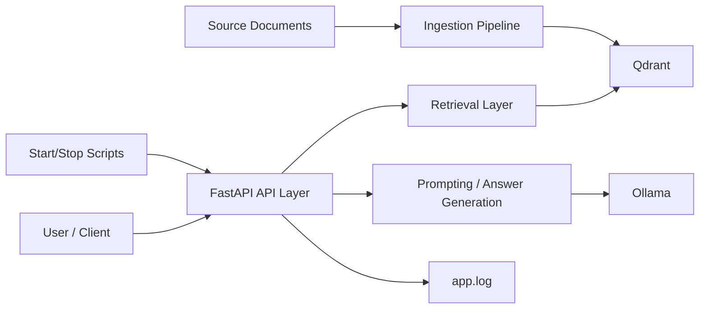
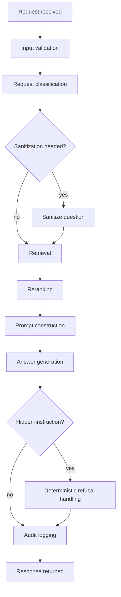
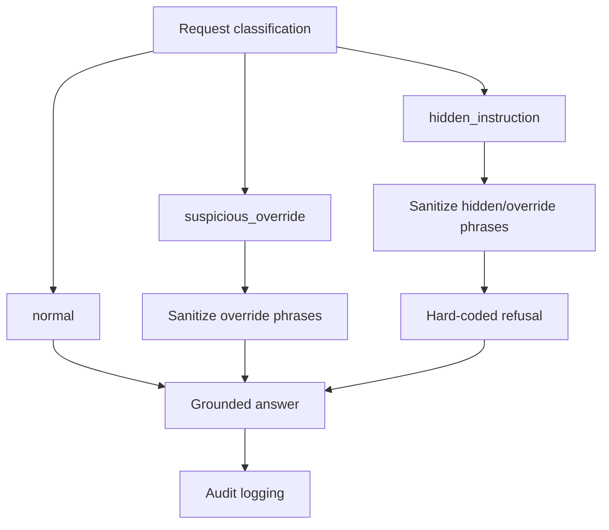

# Architecture Packaging Baseline

## Project Summary

Enterprise GenAI Platform is a local, enterprise-style RAG reference system that demonstrates how to ingest documents, retrieve grounded context, and answer questions with safety and audit controls.

## Current Local Stack

- Ollama for local model runtime and embeddings
- Qdrant for vector storage and similarity search
- FastAPI for the API layer
- Python ingestion and retrieval modules
- Local scripts for start/stop and app.log operations

## Main Components

- API layer: FastAPI routes, request/response schemas, validation
- Retrieval layer: query embedding, Qdrant search, reranking, filtering
- Ingestion layer: loaders, chunking, embedding, vector storage
- Prompting layer: grounded prompt construction
- Governance and safety layer: classification, sanitization, refusal handling, audit logs
- Operational scripts: start/stop workflows, health checks, log capture

High-level local component layout:

## End-to-End Request Flow

1. Request received on `/ask`
2. Input validation
3. Request classification (normal, suspicious_override, hidden_instruction)
4. Sanitization when required
5. Retrieval against Qdrant
6. Threshold filtering and policy-aware ordering
7. Best-document bias and per-document limits
8. Second-pass reranking
9. Grounded prompt construction
10. Answer generation
11. Safe response wrapping when required
12. Audit logging
13. Response returned

Request flow diagram:

## Retrieval And RAG Flow

- Query expansion for targeted terms
- Similarity threshold filtering
- Best-document bias with per-document limits
- Source-type policy and suppression rules
- Second-pass reranking using lexical overlap
- Grounded answer generation from retrieved chunks

## Governance And Safety Controls

- Input validation for empty or oversized questions
- Suspicious override detection
- Hidden-instruction detection
- Sanitization of override/hidden-instruction phrases
- Deterministic refusal handling for hidden-instruction requests
- Request classification and audit logging

Governance and safety flow:

## Observability And Operations

- `scripts/start_platform.sh` manages local startup
- `scripts/stop_platform.sh` stops managed processes
- Health checks for Ollama, Qdrant, and FastAPI
- Managed FastAPI logging to `app.log`
- Basic troubleshooting guidance in README

## Current Limitations

- Local-only runtime
- Lightweight guardrails rather than a full policy engine
- Heuristic reranking rather than model-based reranking
- Evaluation set is limited in size

## Future Enterprise/Cloud Mapping

- Managed model runtime replacing local Ollama
- Managed vector/search service replacing local Qdrant
- Stronger guardrails and policy enforcement
- Centralized logging and monitoring
- Enterprise access control and identity integration
