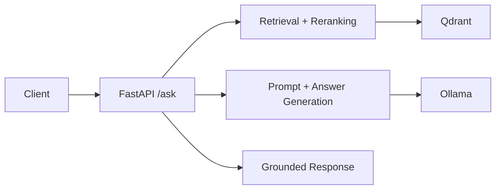

# Project Walkthrough

## Project Overview

Enterprise GenAI Platform is a local, enterprise-style RAG platform that answers questions grounded in enterprise documents with safety and audit controls.

## Problem Statement

Build a grounded assistant over internal and reference documents, improve retrieval quality, reduce hallucinations, handle suspicious requests safely, and keep local operations reliable.

## Current Solution Summary

- FastAPI API layer for `/ask` and health endpoints
- Ollama for local generation and embeddings
- Qdrant for vector storage and similarity search
- Retrieval with filtering, biasing, and reranking
- Evaluation harness for tuning
- Governance and safety controls with deterministic handling
- Operational scripts with managed logging

## Core Architecture

High-level request flow:

## Key Technical Challenges Solved

- Retrieval precision improvement through staged filtering and reranking
- Near-document disambiguation with best-document bias
- Prompt grounding to keep answers tied to sources
- Code-level safety enforcement for hidden-instruction requests
- Evaluation-driven tuning to validate changes
- Local operational reliability with start/stop automation

## Governance And Safety Controls

- Input validation
- Suspicious override detection
- Hidden-instruction detection
- Sanitization
- Deterministic refusal handling
- Audit logging

## Operational Maturity Improvements

- Reliable start/stop workflow
- Health checks for dependencies
- `app.log` capture
- Managed background process handling

## Current Limitations

- Local-only runtime
- Heuristic reranking instead of model-based reranking
- Limited evaluation dataset size
- Lightweight safety controls compared with full enterprise policy engines

## Future Evolution

- Stronger reranking and evaluation coverage
- Richer governance and policy enforcement
- Centralized logging and monitoring
- Managed cloud deployment and access control

## How To Present This Project In An Interview

- Describe it in 1–2 minutes as a grounded enterprise RAG system with safety and audit controls.
- Highlight design decisions: local runtime, staged retrieval improvements, code-level safety.
- Call out trade-offs: heuristic reranking, limited eval set, local-only ops.
- Emphasize why it is enterprise-style: governance, audit logging, and operational discipline beyond a demo.
