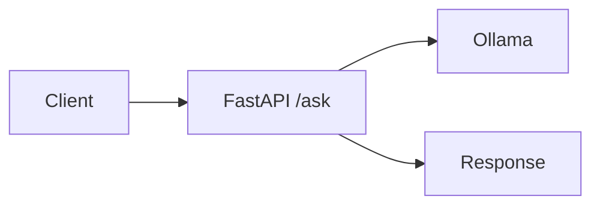
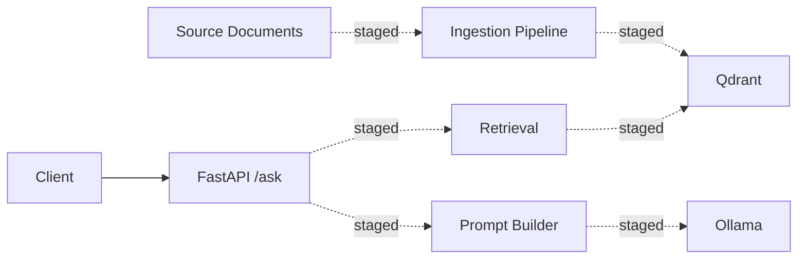

# Project Walkthrough

## Project Overview

Enterprise GenAI Platform is a local, enterprise-style GenAI platform reference project. The current verified API baseline is a FastAPI service with `GET /health` and an Ollama-backed `POST /ask`.

## Problem Statement

Build a local platform that can evolve toward grounded enterprise question answering over internal and reference documents, with stronger governance, evaluation, and operational maturity over time.

## Current Verified Baseline

- FastAPI API layer for `/health` and `/ask`
- `/ask` calls Ollama directly and returns `source: "ollama"`
- Clean error handling for Ollama unavailability in the active route
- Tests currently verify the health route and the Ollama-backed `/ask` path

## Staged Repository Modules

The repository also contains modules for:

- document ingestion and chunking
- embeddings, vector storage, and retrieval
- prompt-building for grounded answers
- broader governance-oriented prompt and retrieval support

These modules exist in the tree, but they are not yet counted as live baseline behavior unless they are wired into the active route and verified.

## Core Architecture

Current live request flow:

Staged architecture in the repository:

## Architecture Value

- Local Ollama integration shows a working model-backed API baseline.
- Retrieval, ingestion, prompt-building, and vector-store modules show the intended RAG direction.
- Governance, evaluation, and operational documents show the enterprise-style operating model around the codebase.

## Current Limitations

- The active `/ask` route is not yet retrieval-backed.
- End-to-end grounded RAG is not yet part of the verified live baseline.
- Staged governance and refusal-oriented prompt logic are not yet presented as verified active-route behavior.
- Local runtime and verification remain lightweight.

## Future Evolution

- Integrate retrieval into the live `/ask` path
- Verify prompt-building and vector-store flow through tests
- Add stronger governance and observability once integrated
- Evolve the local baseline toward cloud-oriented deployment patterns

## How To Present This Project In An Interview

- Describe the current live baseline as a FastAPI service with an Ollama-backed `/ask` route.
- Explain that the repository already includes staged ingestion, retrieval, vector-store, and prompt-building modules for the next RAG step.
- Frame it as an enterprise-style reference project because the codebase includes architecture, governance, and operating-model discipline, while the live baseline remains stated conservatively.
